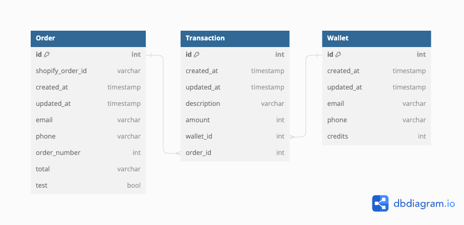

This is a [Next.js](https://nextjs.org/) project bootstrapped with [`create-next-app`](https://github.com/vercel/next.js/tree/canary/packages/create-next-app).

## Setup

This project uses Prisma for data fetching and management. Before running the project, you need to generate the Prisma models.

```bash
npx prisma generate
```

If you want to create a new database, remember to run the migrations:

```bash
npx prisma db pull
```

## Installation

Instructions are straightforward:

```bash
# Install dependencies
npm i
# Generate models
npx prisma generate
# Run the app
npm run dev
```

Open [http://localhost:3000](http://localhost:3000) with your browser to see the result.

## Documentation

### Database

The database schema looks like this:



### API

Some request examples are in the [requests folder](./docs/requests).

Copyrigth 2024 &copy; TepacheLabs
